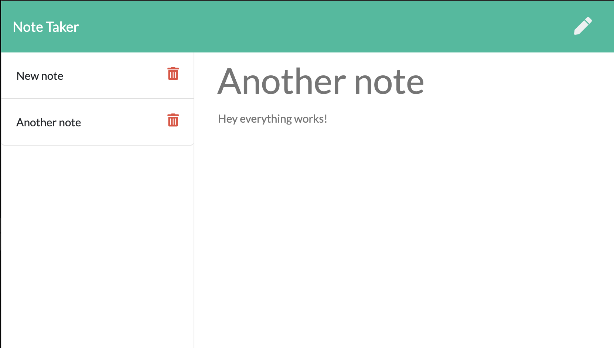

# Note_Taker
A web app that allows users to write and save notes to a server so they can be viewed later.

##Install and Setup

*Fork this repository onto your computer.

*Open the server.js file (located in Master folder) in your command line. Run "npm install" in the command line to install all required node packages.

*Run "node server.js" from the command line to host the server locally.

*Open your browser, and enter "http://localhost:3000/"